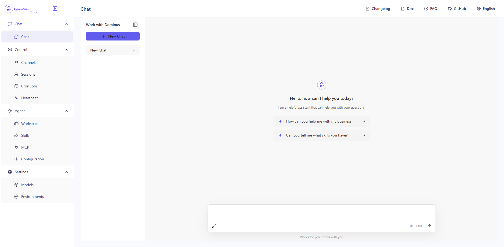

<div align="center">

# DominusPrime

[](https://github.com/BattlescarZA/DominusPrime)
[](https://pypi.org/project/dominusprime/)
[](https://www.python.org/downloads/)
[](https://github.com/BattlescarZA/DominusPrime)
[](LICENSE)
[](https://github.com/psf/black)
[](https://github.com/BattlescarZA/DominusPrime/stargazers)
[](https://github.com/BattlescarZA/DominusPrime/network)


<p align="center"><b>Works for you, grows with you.</b></p>

</div>

Your Personal AI Assistant; easy to install, deploy on your own machine or on the cloud; supports multiple chat apps with easily extensible capabilities.

> **Core capabilities:**
>
> **Every channel** — DingTalk, Feishu, QQ, Discord, iMessage, and more. One assistant, connect as you need.
>
> **Under your control** — Memory and personalization under your control. Deploy locally or in the cloud; scheduled reminders to any channel.
>
> **Skills** — Built-in cron; custom skills in your workspace, auto-loaded. No lock-in.
>
> <details>
> <summary><b>What you can do</b></summary>
>
> <br>
>
> - **Social**: daily digest of hot posts (Xiaohongshu, Zhihu, Reddit), Bilibili/YouTube summaries.
> - **Productivity**: newsletter digests to DingTalk/Feishu/QQ, contacts from email/calendar.
> - **Creative**: describe your goal, run overnight, get a draft next day.
> - **Research**: track tech/AI news, personal knowledge base.
> - **Desktop**: organize files, read/summarize docs, request files in chat.
> - **Explore**: combine Skills and cron into your own agentic app.
>
> </details>

---

## Table of Contents

> **Recommended reading:**
>
> - **I want to run DominusPrime in 3 commands**: [Quick Start](#quick-start) → open Console in browser.
> - **I want to chat in DingTalk / Feishu / QQ**: Configure [channels](https://DominusPrime.agentscope.io/docs/channels) in the Console.
> - **I don’t want to install Python**: [One-line install](#one-line-install-beta-continuously-improving) handles Python automatically, or use [ModelScope one-click](https://modelscope.cn/studios/fork?target=AgentScope/DominusPrime) for cloud deployment.

- [News](#news)
- [Quick Start](#quick-start)
- [API Key](#api-key)
- [Local Models](#local-models)
- [Documentation](#documentation)
- [FAQ](#faq)
- [Install from source](#install-from-source)
- [Why DominusPrime?](#why-DominusPrime)
- [Built by](#built-by)
- [License](#license)

---

## Quick Start

### Quick Install

**Step 1: Clone the repository**

```bash
git clone https://github.com/BattlescarZA/DominusPrime.git
cd DominusPrime
```

**Step 2: Run the installer**

**Linux / macOS:**

```bash
chmod +x scripts/install.sh
./scripts/install.sh
```

**Windows (PowerShell):**

```powershell
.\scripts\install.ps1
```

**Step 3: Initialize and start**

```bash
dominusprime init --defaults
dominusprime app
```

Then open **http://127.0.0.1:9999/** in your browser for the Console (chat with DominusPrime, configure the agent).



### Alternative: pip install

If you prefer managing Python yourself:

```bash
pip install DominusPrime
DominusPrime init --defaults
DominusPrime app
```

### Using Docker

Images are on **Docker Hub** (`agentscope/DominusPrime`). Image tags: `latest` (stable); `pre` (PyPI pre-release).

```bash
docker pull agentscope/DominusPrime:latest
docker run -p 127.0.0.1:9999:9999 -v DominusPrime-data:/app/working agentscope/DominusPrime:latest
```

Also available on Alibaba Cloud Container Registry (ACR) for users in China: `agentscope-registry.ap-southeast-1.cr.aliyuncs.com/agentscope/DominusPrime` (same tags).

Then open **http://127.0.0.1:9999/** for the Console. Config, memory, and skills are stored in the `DominusPrime-data` volume. To pass API keys (e.g. `DASHSCOPE_API_KEY`), add `-e VAR=value` or `--env-file .env` to `docker run`.

> **Connecting to Ollama or other services on the host machine**
>
> Inside a Docker container, `localhost` refers to the container itself, not your host machine. If you run Ollama (or other model services) on the host and want DominusPrime in Docker to reach them, use one of these approaches:
>
> **Option A** — Explicit host binding (all platforms):
> ```bash
> docker run -p 127.0.0.1:9999:9999 \
>   --add-host=host.docker.internal:host-gateway \
>   -v DominusPrime-data:/app/working agentscope/DominusPrime:latest
> ```
> Then in DominusPrime **Settings → Models → Ollama**, change the Base URL to `http://host.docker.internal:11434/v1` or your corresponding port.
>
> **Option B** — Host networking (Linux only):
> ```bash
> docker run --network=host -v DominusPrime-data:/app/working agentscope/DominusPrime:latest
> ```
> No port mapping (`-p`) is needed; the container shares the host network directly. Note that all container ports are exposed on the host, which may cause conflicts if the port is already in use.

The image is built from scratch. To build the image yourself, please refer to the [Build Docker image](scripts/README.md#build-docker-image) section in `scripts/README.md`, and then push to your registry.

### Using ModelScope

**No local install?** [ModelScope Studio](https://modelscope.cn/studios/fork?target=AgentScope/DominusPrime) one-click cloud setup. Set your Studio to **non-public** so others cannot control your DominusPrime.

### Deploy on Alibaba Cloud ECS

To run DominusPrime on Alibaba Cloud (ECS), use the one-click deployment: open the [DominusPrime on Alibaba Cloud (ECS) deployment link](https://computenest.console.aliyun.com/service/instance/create/cn-hangzhou?type=user&ServiceId=service-1ed84201799f40879884) and follow the prompts. For step-by-step instructions, see [Alibaba Cloud Developer: Deploy your AI assistant in 3 minutes](https://developer.aliyun.com/article/1713682).

---

## API Key

If you use a **cloud LLM** (e.g. DashScope, ModelScope), you must configure an API key before chatting. DominusPrime will not work until a valid key is set. See the [official docs](https://DominusPrime.agentscope.io/docs/models#configure-cloud-providers) for details.

**How to configure:**

1. **Console (recommended)** — After running `DominusPrime app`, open **http://127.0.0.1:9999/** → **Settings** → **Models**. Choose a provider, enter the **API Key**, and enable that provider and model.
2. **`DominusPrime init`** — When you run `DominusPrime init`, it will guide you through configuring the LLM provider and API key. Follow the prompts to choose a provider and enter your key.
3. **Environment variable** — For DashScope you can set `DASHSCOPE_API_KEY` in your shell or in a `.env` file in the working directory.

Tools that need extra keys (e.g. `TAVILY_API_KEY` for web search) can be set in Console **Settings → Environment variables**, or see [Config](https://DominusPrime.agentscope.io/docs/config) for details.

> **Using local models only?** If you use [Local Models](#local-models) (llama.cpp or MLX), you do **not** need any API key.

## Local Models

DominusPrime can run LLMs entirely on your machine — no API keys or cloud services required. See the [official docs](https://DominusPrime.agentscope.io/docs/models#local-providers-llamacpp--mlx) for details.

| Backend       | Best for                                 | Install                                                              |
| ------------- | ---------------------------------------- | -------------------------------------------------------------------- |
| **llama.cpp** | Cross-platform (macOS / Linux / Windows) | `pip install 'DominusPrime[llamacpp]'` or `bash install.sh --extras llamacpp` |
| **MLX**       | Apple Silicon Macs (M1/M2/M3/M4)         | `pip install 'DominusPrime[mlx]'` or `bash install.sh --extras mlx`         |
| **Ollama**    | Cross-platform (requires Ollama service) | `pip install 'DominusPrime[ollama]'` or `bash install.sh --extras ollama`   |

After installing, you can download and manage local models in the **Console** UI. You can also use the command line:

```bash
DominusPrime models download Qwen/Qwen3-4B-GGUF
DominusPrime models # select the downloaded model
DominusPrime app # start the server
```

### Recommended: llama-server Auto-Setup

For the best local model experience, we recommend using our automated llama-server installer with the **Qwen3.5-9B-VL** model. This script will:

- Build llama.cpp with CUDA GPU acceleration
- Download and configure the Qwen3.5-9B-VL model (~5.5GB)
- Auto-detect your GPU VRAM and set optimal context size
- Create a grammar-safe proxy for DominusPrime compatibility
- Set up auto-start services (systemd on Linux, start scripts on Windows)

**macOS / Linux:**

```bash
curl -fsSL https://raw.githubusercontent.com/BattlescarZA/DominusPrime/main/scripts/install_llama_server.sh | bash
```

**Windows (PowerShell):**

```powershell
irm https://raw.githubusercontent.com/BattlescarZA/DominusPrime/main/scripts/install_llama_server.ps1 | iex
```

For detailed manual setup instructions, see [LLAMA_CPP_SETUP.md](LLAMA_CPP_SETUP.md).

---

## Documentation

| Topic                                                                 | Description                                      |
| --------------------------------------------------------------------- | ------------------------------------------------ |
| [Introduction](https://DominusPrime.agentscope.io/docs/intro)                | What DominusPrime is and how to use it                  |
| [Quick start](https://DominusPrime.agentscope.io/docs/quickstart)            | Install and run (local or ModelScope Studio)    |
| [Console](https://DominusPrime.agentscope.io/docs/console)                   | Web UI: chat and agent configuration            |
| [Models](https://DominusPrime.agentscope.io/docs/models)                     | Configure cloud, local, and custom providers    |
| [Channels](https://DominusPrime.agentscope.io/docs/channels)                  | DingTalk, Feishu, QQ, Discord, iMessage, and more |
| [Skills](https://DominusPrime.agentscope.io/docs/skills)                      | Extend and customize capabilities               |
| [MCP](https://DominusPrime.agentscope.io/docs/skills)                        | Manage MCP clients                               |
| [Memory](https://DominusPrime.agentscope.io/docs/memory)                     | Context and long-term memory                     |
| [Magic commands](https://DominusPrime.agentscope.io/docs/commands)           | Control conversation state without waiting for the AI |
| [Heartbeat](https://DominusPrime.agentscope.io/docs/heartbeat)                | Scheduled check-in and digest                    |
| [Config & working dir](https://DominusPrime.agentscope.io/docs/config) | Working directory and config file                |
| [CLI](https://DominusPrime.agentscope.io/docs/cli)                            | Init, cron jobs, skills, clean                   |
| [FAQ](https://github.com/BattlescarZA/DominusPrime/wiki)                     | Common questions and troubleshooting             |

Full docs in this repo: [website/public/docs/](website/public/docs/).

---

## FAQ

For common questions, troubleshooting tips, and known issues, please visit the **[FAQ page](https://github.com/BattlescarZA/DominusPrime/wiki)**.

---

## Install from source

```bash
git clone https://github.com/agentscope-ai/DominusPrime.git
cd DominusPrime

# Build console frontend first (required for web UI)
cd console && npm ci && npm run build
cd ..

# Copy console build output to package directory
mkdir -p src/DominusPrime/console
cp -R console/dist/. src/DominusPrime/console/

# Install Python package
pip install -e .
```

- **Dev** (tests, formatting): `pip install -e ".[dev]"`
- **Then**: Run `DominusPrime init --defaults`, then `DominusPrime app`.

---

## License

DominusPrime is released under the [Apache License 2.0](LICENSE).

