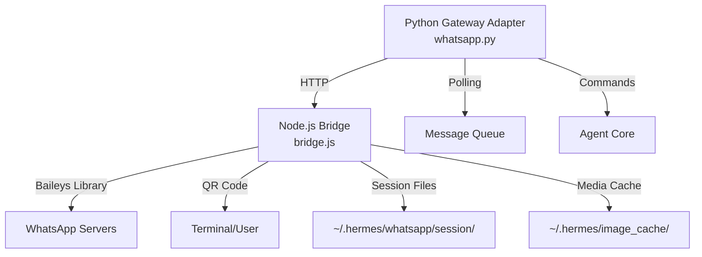

# Hermes Agent Feature Analysis & Implementation Plan

## Executive Summary

This document analyzes the hermes-agent repository to identify features missing from DominusPrime and provides detailed implementation strategies, with a focus on their superior WhatsApp integration.

**Repository:** https://github.com/nousresearch/hermes-agent  
**Analysis Date:** March 31, 2026  
**DominusPrime Version:** 0.9.11

---

## Table of Contents

1. [WhatsApp Integration (Priority #1)](#whatsapp-integration-priority-1)
2. [Missing Features Comparison](#missing-features-comparison)
3. [Architecture Differences](#architecture-differences)
4. [Implementation Roadmap](#implementation-roadmap)

---

## WhatsApp Integration (Priority #1)

### Why Hermes' Approach is Superior

DominusPrime currently has WhatsApp support but Hermes' implementation is **significantly better**:

| Feature | DominusPrime Current | Hermes Agent | Winner |
|---------|---------------------|--------------|---------|
| **Library** | whatsapp-web.js (deprecated/buggy) | Baileys (actively maintained) | ✅ Hermes |
| **Architecture** | Tightly coupled | HTTP bridge pattern | ✅ Hermes |
| **Media Support** | Limited | Full (images, video, audio, docs) | ✅ Hermes |
| **Message Editing** | No | Yes | ✅ Hermes |
| **Self-Chat Mode** | No | Yes (single number for bot + user) | ✅ Hermes |
| **Bot Mode** | Partial | Full (separate bot number) | ✅ Hermes |
| **Session Management** | Basic | Advanced with lock mechanism | ✅ Hermes |
| **Allowlist** | No | Yes (security for public bots) | ✅ Hermes |
| **Auto-reconnect** | Basic | Robust (handles code 515, etc.) | ✅ Hermes |
| **Process Management** | Manual | Automatic (kills orphans, health checks) | ✅ Hermes |

### Hermes WhatsApp Architecture



### Key Components

#### 1. Node.js Bridge (`bridge.js`)

**Purpose:** Standalone process that connects to WhatsApp and exposes HTTP endpoints

**Dependencies:**
```json
{
  "@whiskeysockets/baileys": "7.0.0-rc.9",
  "express": "^4.21.0",
  "qrcode-terminal": "^0.12.0",
  "pino": "^9.0.0"
}
```

**HTTP Endpoints:**
- `GET /health` - Health check with connection status
- `GET /messages` - Long-poll for incoming messages
- `POST /send` - Send text message
- `POST /edit` - Edit previously sent message
- `POST /send-media` - Send media (image/video/audio/document)
- `POST /typing` - Send typing indicator
- `GET /chat/:id` - Get chat info (name, participants, type)

**Features:**
- QR code pairing (in-terminal)
- Session persistence (multi-file auth state)
- Automatic reconnection on disconnect
- Process group management (kills all child processes on exit)
- Media download and caching
- Support for both bot mode and self-chat mode
- Allowlist for restricting who can message the bot
- Echo-back prevention (tracks recently sent message IDs)
- LID (Linked Identity Device) support for new WhatsApp format

#### 2. Python Adapter (`whatsapp.py`)

**Purpose:** Gateway adapter that manages the Node.js bridge and handles messages

**Key Features:**
- Subprocess management (starts/stops bridge)
- Automatic npm dependency installation
- Session lock mechanism (prevents duplicate sessions)
- HTTP client for bridge communication
- Message polling task
- Media URL caching (downloads to local cache)
- Text document injection (auto-reads .txt/.md/.csv/etc files)
- Health monitoring (detects bridge crashes)
- Fatal error handling with notifications
- Port conflict resolution

**Architecture Pattern:**
```python
class WhatsAppAdapter(BasePlatformAdapter):
    def __init__(self, config):
        # Bridge configuration
        self._bridge_port = 3000
        self._bridge_script = "scripts/whatsapp-bridge/bridge.js"
        self._session_path = "~/.hermes/whatsapp/session"
        
    async def connect(self):
        # 1. Check Node.js availability
        # 2. Install npm dependencies if needed
        # 3. Acquire session lock (prevent duplicates)
        # 4. Check if bridge already running
        # 5. Kill orphaned processes
        # 6. Start bridge subprocess
        # 7. Wait for HTTP server ready
        # 8. Wait for WhatsApp connection
        # 9. Start message polling task
        
    async def _poll_messages(self):
        # Long-poll /messages endpoint every 1 second
        # Build MessageEvent from bridge data
        # Download and cache media
        # Pass to handle_message()
        
    async def send(self, chat_id, content, reply_to=None):
        # POST to /send endpoint
        # Returns SendResult with message_id
```

### Implementation for DominusPrime

#### Step 1: Add Baileys Bridge to DominusPrime

Create `scripts/whatsapp-bridge/` directory with:

**Files to copy from Hermes:**
1. `scripts/whatsapp-bridge/bridge.js` - Main bridge (with minor adaptations)
2. `scripts/whatsapp-bridge/package.json` - Dependencies
3. `scripts/whatsapp-bridge/allowlist.js` - User allowlist utilities
4. `scripts/whatsapp-bridge/allowlist.test.mjs` - Tests

**Modifications needed:**
```javascript
// Change import paths if needed
// Update default session path to ~/.dominusprime/
const SESSION_DIR = getArg('session', 
    path.join(process.env.HOME || '~', '.dominusprime', 'whatsapp', 'session'));

// Update cache directories
const IMAGE_CACHE_DIR = path.join(process.env.HOME || '~', '.dominusprime', 'image_cache');
const DOCUMENT_CACHE_DIR = path.join(process.env.HOME || '~', '.dominusprime', 'document_cache');
const AUDIO_CACHE_DIR = path.join(process.env.HOME || '~', '.dominusprime', 'audio_cache');
```

#### Step 2: Replace WhatsApp Adapter

**Current:** `src/dominusprime/app/channels/whatsapp/channel.py` (using whatsapp-web.js)  
**Replace with:** Hermes' `gateway/platforms/whatsapp.py` approach

**File:** `src/dominusprime/app/channels/whatsapp/adapter.py`

```python
"""
WhatsApp channel adapter using Baileys bridge.
Based on hermes-agent implementation.
"""

import asyncio
import logging
import os
import platform
import subprocess
from pathlib import Path
from typing import Dict, Optional, Any

from ...constant import get_dominusprime_dir
from ..base import BaseChannelAdapter, MessageEvent

logger = logging.getLogger(__name__)

_IS_WINDOWS = platform.system() == "Windows"


class WhatsAppAdapter(BaseChannelAdapter):
    """
    WhatsApp adapter using Node.js Baileys bridge.
    
    This is a superior implementation compared to whatsapp-web.js:
    - Uses actively maintained Baileys library
    - HTTP bridge pattern (decoupled)
    - Full media support (images, videos, audio, documents)
    - Message editing
    - Self-chat mode support
    - Robust session management
    - Automatic reconnection
    """
    
    MAX_MESSAGE_LENGTH = 65536
    
    def __init__(self, config: Dict[str, Any]):
        super().__init__(config)
        self._bridge_process: Optional[subprocess.Popen] = None
        self._bridge_port: int = config.get("bridge_port", 3000)
        
        # Default bridge location
        bridge_dir = Path(__file__).resolve().parents[4] / "scripts" / "whatsapp-bridge"
        self._bridge_script: str = config.get(
            "bridge_script",
            str(bridge_dir / "bridge.js")
        )
        
        self._session_path: Path = Path(config.get(
            "session_path",
            get_dominusprime_dir() / "platforms" / "whatsapp" / "session"
        ))
        
        self._mode: str = config.get("mode", os.getenv("WHATSAPP_MODE", "self-chat"))
        self._allowed_users: Optional[str] = config.get("allowed_users", 
                                                        os.getenv("WHATSAPP_ALLOWED_USERS"))
        self._reply_prefix: Optional[str] = config.get("reply_prefix")
        
        self._http_session: Optional["aiohttp.ClientSession"] = None
        self._poll_task: Optional[asyncio.Task] = None
        self._bridge_log: Optional[Path] = None
        
    async def connect(self) -> bool:
        """Start the WhatsApp Baileys bridge."""
        # Check Node.js availability
        if not self._check_nodejs():
            logger.error("Node.js not found. WhatsApp requires Node.js >= 16")
            return False
        
        bridge_path = Path(self._bridge_script)
        if not bridge_path.exists():
            logger.error(f"Bridge script not found: {bridge_path}")
            return False
        
        # Auto-install dependencies
        if not await self._ensure_bridge_dependencies(bridge_path.parent):
            return False
        
        # Start bridge subprocess
        return await self._start_bridge(bridge_path)
    
    def _check_nodejs(self) -> bool:
        """Check if Node.js is installed."""
        try:
            result = subprocess.run(
                ["node", "--version"],
                capture_output=True,
                text=True,
                timeout=5
            )
            return result.returncode == 0
        except Exception:
            return False
    
    async def _ensure_bridge_dependencies(self, bridge_dir: Path) -> bool:
        """Install npm dependencies if needed."""
        if (bridge_dir / "node_modules").exists():
            return True
        
        logger.info("Installing WhatsApp bridge dependencies...")
        try:
            result = subprocess.run(
                ["npm", "install", "--silent"],
                cwd=str(bridge_dir),
                capture_output=True,
                text=True,
                timeout=60
            )
            if result.returncode != 0:
                logger.error(f"npm install failed: {result.stderr}")
                return False
            logger.info("Dependencies installed successfully")
            return True
        except Exception as e:
            logger.error(f"Failed to install dependencies: {e}")
            return False
    
    async def _start_bridge(self, bridge_path: Path) -> bool:
        """Start the Node.js bridge process."""
        import aiohttp
        
        # Ensure session directory exists
        self._session_path.mkdir(parents=True, exist_ok=True)
        
        # Setup logging
        self._bridge_log = self._session_path.parent / "bridge.log"
        bridge_log_fh = open(self._bridge_log, "a")
        
        # Build environment
        bridge_env = os.environ.copy()
        if self._reply_prefix:
            bridge_env["WHATSAPP_REPLY_PREFIX"] = self._reply_prefix
        if self._allowed_users:
            bridge_env["WHATSAPP_ALLOWED_USERS"] = self._allowed_users
        bridge_env["WHATSAPP_MODE"] = self._mode
        
        # Start bridge subprocess
        self._bridge_process = subprocess.Popen(
            [
                "node",
                str(bridge_path),
                "--port", str(self._bridge_port),
                "--session", str(self._session_path),
                "--mode", self._mode,
            ],
            stdout=bridge_log_fh,
            stderr=bridge_log_fh,
            preexec_fn=None if _IS_WINDOWS else os.setsid,
            env=bridge_env,
        )
        
        # Wait for bridge to be ready (Phase 1: HTTP server)
        for attempt in range(15):
            await asyncio.sleep(1)
            if self._bridge_process.poll() is not None:
                logger.error(f"Bridge process died. Check log: {self._bridge_log}")
                return False
            
            try:
                async with aiohttp.ClientSession() as session:
                    async with session.get(
                        f"http://127.0.0.1:{self._bridge_port}/health",
                        timeout=aiohttp.ClientTimeout(total=2)
                    ) as resp:
                        if resp.status == 200:
                            data = await resp.json()
                            if data.get("status") == "connected":
                                logger.info("WhatsApp bridge connected!")
                                break
            except Exception:
                continue
        else:
            # Phase 2: Wait for WhatsApp connection
            logger.info("Bridge HTTP ready, waiting for WhatsApp connection...")
            for attempt in range(15):
                await asyncio.sleep(1)
                try:
                    async with aiohttp.ClientSession() as session:
                        async with session.get(
                            f"http://127.0.0.1:{self._bridge_port}/health",
                            timeout=aiohttp.ClientTimeout(total=2)
                        ) as resp:
                            if resp.status == 200:
                                data = await resp.json()
                                if data.get("status") == "connected":
                                    logger.info("WhatsApp connected!")
                                    break
                except Exception:
                    continue
            else:
                logger.warning("WhatsApp not connected after 30s")
                logger.warning(f"Check bridge log: {self._bridge_log}")
                logger.warning("If session expired, re-pair with QR code")
        
        # Create HTTP session
        self._http_session = aiohttp.ClientSession()
        
        # Start polling task
        self._poll_task = asyncio.create_task(self._poll_messages())
        
        logger.info(f"WhatsApp bridge started on port {self._bridge_port}")
        return True
    
    async def _poll_messages(self) -> None:
        """Poll the bridge for incoming messages."""
        import aiohttp
        
        while True:
            try:
                async with self._http_session.get(
                    f"http://127.0.0.1:{self._bridge_port}/messages",
                    timeout=aiohttp.ClientTimeout(total=30)
                ) as resp:
                    if resp.status == 200:
                        messages = await resp.json()
                        for msg_data in messages:
                            event = await self._build_message_event(msg_data)
                            if event:
                                await self.handle_message(event)
            except asyncio.CancelledError:
                break
            except Exception as e:
                logger.error(f"Poll error: {e}")
                await asyncio.sleep(5)
            
            await asyncio.sleep(1)
    
    async def _build_message_event(self, data: Dict[str, Any]) -> Optional[MessageEvent]:
        """Build a MessageEvent from bridge data."""
        # Implementation similar to Hermes
        # Download and cache media
        # Return MessageEvent
        pass
    
    async def send_message(
        self,
        chat_id: str,
        content: str,
        reply_to: Optional[str] = None
    ) -> bool:
        """Send a message via the bridge."""
        if not self._http_session:
            return False
        
        try:
            import aiohttp
            
            payload = {
                "chatId": chat_id,
                "message": content,
            }
            if reply_to:
                payload["replyTo"] = reply_to
            
            async with self._http_session.post(
                f"http://127.0.0.1:{self._bridge_port}/send",
                json=payload,
                timeout=aiohttp.ClientTimeout(total=30)
            ) as resp:
                return resp.status == 200
        except Exception as e:
            logger.error(f"Send error: {e}")
            return False
    
    async def disconnect(self) -> None:
        """Stop the bridge and clean up."""
        if self._poll_task:
            self._poll_task.cancel()
            try:
                await self._poll_task
            except asyncio.CancelledError:
                pass
        
        if self._http_session:
            await self._http_session.close()
        
        if self._bridge_process:
            try:
                if _IS_WINDOWS:
                    self._bridge_process.terminate()
                else:
                    os.killpg(os.getpgid(self._bridge_process.pid), signal.SIGTERM)
                await asyncio.sleep(1)
                if self._bridge_process.poll() is None:
                    if _IS_WINDOWS:
                        self._bridge_process.kill()
                    else:
                        os.killpg(os.getpgid(self._bridge_process.pid), signal.SIGKILL)
            except Exception as e:
                logger.error(f"Error stopping bridge: {e}")
        
        logger.info("WhatsApp disconnected")
```

#### Step 3: Add CLI Commands for WhatsApp

**File:** `src/dominusprime/cli/whatsapp_cmd.py`

```python
"""WhatsApp pairing and management commands."""

import click
import subprocess
from pathlib import Path


@click.group(name="whatsapp")
def whatsapp_group():
    """Manage WhatsApp integration."""
    pass


@whatsapp_group.command(name="pair")
def pair_command():
    """Pair WhatsApp with QR code."""
    bridge_script = Path(__file__).parents[2] / "scripts" / "whatsapp-bridge" / "bridge.js"
    
    if not bridge_script.exists():
        click.echo(f"Error: Bridge script not found at {bridge_script}")
        return
    
    click.echo("Starting WhatsApp pairing...")
    click.echo("Scan the QR code with WhatsApp on your phone")
    click.echo()
    
    subprocess.run([
        "node",
        str(bridge_script),
        "--pair-only",
        "--session", str(Path.home() / ".dominusprime" / "whatsapp" / "session")
    ])


@whatsapp_group.command(name="status")
def status_command():
    """Check WhatsApp bridge status."""
    import requests
    
    try:
        resp = requests.get("http://127.0.0.1:3000/health", timeout=2)
        data = resp.json()
        click.echo(f"Status: {data.get('status', 'unknown')}")
        click.echo(f"Queue: {data.get('queueLength', 0)} messages")
        click.echo(f"Uptime: {data.get('uptime', 0):.1f}s")
    except Exception:
        click.echo("Bridge not running")
```

#### Step 4: Update Installation Scripts

Add to `scripts/install.ps1` and `scripts/install.sh`:

```bash
# Check Node.js
if ! command -v node &>/dev/null; then
    echo "Installing Node.js..."
    # Use nvm or system package manager
fi

# Install WhatsApp bridge dependencies
cd scripts/whatsapp-bridge
npm install
cd ../..
```

---

## Missing Features Comparison

### 1. Advanced TUI (Terminal User Interface)

**Hermes Has:**
- Full curses-based TUI with multiline editing
- Slash-command autocomplete
- Conversation history navigation
- Interrupt-and-redirect
- Streaming tool output display
- Syntax highlighting for code blocks

**DominusPrime Status:** ❌ Basic CLI only

**Implementation Priority:** Medium

**Effort:** High (requires curses/textual framework)

**Implementation:**
```python
# Use textual framework
from textual.app import App
from textual.widgets import Input, TextLog, Header

class DominusPrimeTUI(App):
    """Advanced TUI for DominusPrime."""
    
    def compose(self):
        yield Header()
        yield TextLog(id="conversation")
        yield Input(placeholder="Message...", id="input")
    
    def on_input_submitted(self, event):
        # Send message to agent
        # Stream response to TextLog
        pass
```

### 2. Skills System with Auto-Generation

**Hermes Has:**
- Autonomous skill creation after complex tasks
- Skills self-improve during use
- Skills Hub (agentskills.io compatible)
- Skill versioning and sharing

**DominusPrime Status:** ✅ Has skills but not self-generating

**Implementation Priority:** High (aligns with self-improvement system)

**Effort:** Medium

**Implementation:**
Integrate with the self-improvement system we just built:
```python
# After task completion
if task_was_complex and task_succeeded:
    skill = await agent.generate_skill_from_trajectory(trajectory)
    await agent.save_skill(skill)
    await agent.notify_user(f"Created new skill: {skill.name}")
```

### 3. Advanced Memory System

**Hermes Has:**
- FTS5 session search (SQLite full-text search)
- LLM-powered summarization for cross-session recall
- Honcho dialectic user modeling
- Periodic memory nudges
- Memory compaction with importance scoring

**DominusPrime Status:** ✅ Has basic memory

**Implementation Priority:** High

**Effort:** Medium-High

**Implementation:**
```python
# Add FTS5 search to existing memory
import sqlite3

conn = sqlite3.connect("memory.db")
conn.execute("""
    CREATE VIRTUAL TABLE memory_fts USING fts5(
        content,
        timestamp,
        session_id,
        importance
    )
""")

# Search across sessions
results = conn.execute("""
    SELECT * FROM memory_fts 
    WHERE memory_fts MATCH ?
    ORDER BY rank
    LIMIT 10
""", (query,)).fetchall()
```

### 4. Scheduled Automations (Cron)

**Hermes Has:**
- Built-in cron scheduler
- Natural language cron expressions
- Delivery to any platform (Telegram, Discord, etc.)
- Persistent cron jobs
- Timezone-aware scheduling

**DominusPrime Status:** ✅ Has APScheduler integration

**Implementation Priority:** Low (already have similar)

**Effort:** Low

**Enhancement:** Add natural language parsing for cron expressions

### 5. Subagent Delegation

**Hermes Has:**
- Spawn isolated subagents for parallel workstreams
- Python scripts that call tools via RPC
- Collapse multi-step pipelines into zero-context-cost turns
- Subagent result aggregation

**DominusPrime Status:** ❌ Single agent only

**Implementation Priority:** Medium

**Effort:** High

**Implementation:**
```python
class SubagentManager:
    """Manages parallel subagent execution."""
    
    async def spawn_subagent(self, task: str, tools: List[str]) -> str:
        """Spawn a new subagent with specific tools."""
        subagent_id = f"subagent_{uuid.uuid4()}"
        
        # Create isolated context
        subagent = Agent(
            agent_id=subagent_id,
            tools=tools,
            parent_agent=self.agent_id
        )
        
        # Run in background
        task = asyncio.create_task(subagent.execute_task(task))
        self.subagents[subagent_id] = task
        
        return subagent_id
    
    async def collect_results(self, subagent_ids: List[str]) -> Dict[str, Any]:
        """Wait for subagents and collect results."""
        results = {}
        for sid in subagent_ids:
            result = await self.subagents[sid]
            results[sid] = result
        return results
```

### 6. Terminal Backends

**Hermes Has:**
- Local terminal
- Docker containers
- SSH remote
- Daytona (serverless persistence)
- Singularity containers
- Modal (serverless GPU)

**DominusPrime Status:** ✅ Local only

**Implementation Priority:** Medium

**Effort:** High

**Implementation:**
Create backend abstraction:
```python
class TerminalBackend(ABC):
    @abstractmethod
    async def execute(self, command: str) -> str:
        pass

class DockerBackend(TerminalBackend):
    async def execute(self, command: str) -> str:
        # Execute in Docker container
        pass

class SSHBackend(TerminalBackend):
    async def execute(self, command: str) -> str:
        # Execute via SSH
        pass
```

### 7. Context Files

**Hermes Has:**
- Project-specific context files
- Automatically included in every conversation
- Shapes agent behavior per project
- Workspace-level instructions

**DominusPrime Status:** ❌ No context file system

**Implementation Priority:** Medium

**Effort:** Low

**Implementation:**
```python
def load_context_files(workspace: Path) -> str:
    """Load context files from workspace."""
    context_files = [
        workspace / ".hermes" / "CONTEXT.md",
        workspace / ".hermes" / "PROJECT.md",
        workspace / "README.md"
    ]
    
    context = []
    for file in context_files:
        if file.exists():
            context.append(f"=== {file.name} ===\n{file.read_text()}\n")
    
    return "\n".join(context)
```

### 8. Batch Trajectory Generation

**Hermes Has:**
- Generate training data from agent runs
- Trajectory compression
- Atropos RL environments
- Research-ready output format

**DominusPrime Status:** ❌ No research features

**Implementation Priority:** Low (research-focused)

**Effort:** High

**Skip:** Not needed for production use

### 9. Voice Support

**Hermes Has:**
- Voice memo transcription (Telegram, Discord)
- ElevenLabs TTS integration
- Cross-platform voice handling

**DominusPrime Status:** ✅ Has voice support

**Implementation Priority:** Low

**Effort:** Low

**Enhancement:** Add ElevenLabs integration

### 10. Smart Model Routing

**Hermes Has:**
- Automatic model selection based on task
- Model capability matching
- Cost optimization
- Fallback chains

**DominusPrime Status:** ❌ Manual model selection

**Implementation Priority:** Medium

**Effort:** Medium

**Implementation:**
```python
class SmartModelRouter:
    """Routes tasks to optimal models."""
    
    TASK_MODELS = {
        "code": ["claude-sonnet-4", "gpt-4"],
        "simple": ["gpt-4o-mini", "claude-haiku"],
        "vision": ["gpt-4-vision", "claude-opus"],
        "long_context": ["claude-opus", "gemini-pro"],
    }
    
    def select_model(self, task_type: str, context_length: int) -> str:
        """Select optimal model for task."""
        candidates = self.TASK_MODELS.get(task_type, ["gpt-4"])
        
        # Filter by context length
        if context_length > 100000:
            candidates = [m for m in candidates if "claude" in m or "gemini" in m]
        
        return candidates[0]
```

---

## Architecture Differences

### Hermes Agent Architecture

```
hermes_cli/
├── main.py          # CLI entry point
├── curses_ui.py     # TUI implementation
├── commands.py      # Slash commands
├── models.py        # Model provider abstractions
└── gateway.py       # Messaging gateway management

agent/
├── anthropic_adapter.py    # Claude integration
├── prompt_builder.py       # Dynamic prompt assembly
├── trajectory.py           # Conversation tracking
├── skill_commands.py       # Skill execution
└── context_compressor.py   # Memory management

gateway/
├── run.py           # Gateway process
├── session.py       # Session management
└── platforms/       # Platform adapters
    ├── telegram.py
    ├── discord.py
    ├── whatsapp.py  # ← This is what we want!
    └── signal.py

tools/
├── file_operations.py
├── memory_tool.py
├── mcp_tool.py
└── honcho_tools.py
```

### DominusPrime Architecture

```
src/dominusprime/
├── cli/             # CLI commands
├── app/             # Core application
│   ├── channels/    # Channel adapters
│   └── runner/      # Agent runner
├── agents/          # Agent logic
│   ├── skills/      # Skills
│   └── tools/       # Tools
└── config/          # Configuration

Current: Monolithic channel implementations
Hermes: Modular gateway + platform adapters
```

### Key Architectural Lessons

1. **Separation of Concerns**
   - Hermes: Gateway process separate from agent
   - DominusPrime: Tightly coupled
   - **Recommendation:** Keep current architecture but improve modularity

2. **Platform Abstraction**
   - Hermes: Clean `BasePlatformAdapter` interface
   - DominusPrime: Has `BaseChannel` but less standardized
   - **Recommendation:** Standardize channel interface

3. **Process Management**
   - Hermes: Robust subprocess handling (process groups, health checks)
   - DominusPrime: Basic subprocess management
   - **Recommendation:** Add health monitoring and automatic restarts

---

## Implementation Roadmap

### Phase 1: WhatsApp Integration (2-3 weeks)

**Goal:** Replace whatsapp-web.js with Baileys bridge

#### Week 1: Bridge Setup
- [ ] Copy Baileys bridge files to `scripts/whatsapp-bridge/`
- [ ] Adapt bridge.js for DominusPrime paths
- [ ] Update package.json dependencies
- [ ] Test bridge standalone (pairing, sending, receiving)
- [ ] Document QR pairing process

#### Week 2: Python Adapter
- [ ] Create new `whatsapp/adapter.py` using Hermes pattern
- [ ] Implement subprocess management
- [ ] Add HTTP client for bridge communication
- [ ] Implement message polling
- [ ] Add media handling (download, cache, upload)
- [ ] Test with real WhatsApp account

#### Week 3: Integration & Testing
- [ ] Replace old WhatsApp channel
- [ ] Add CLI commands (`dominusprime whatsapp pair`)
- [ ] Update documentation
- [ ] Test self-chat mode
- [ ] Test bot mode
- [ ] Test media (images, videos, audio, documents)
- [ ] Test message editing
- [ ] Test group chats
- [ ] Update installation scripts (Node.js check)

**Deliverables:**
- Working Baileys-based WhatsApp integration
- CLI commands for pairing and status
- Updated documentation
- Integration tests

### Phase 2: Skills Auto-Generation (2 weeks)

**Goal:** Integrate skill auto-generation with self-improvement system

#### Week 1: Skill Generation
- [ ] Add trajectory tracking
- [ ] Implement skill template generation
- [ ] Create skill validation
- [ ] Add skill storage
- [ ] Implement skill versioning

#### Week 2: Skill Improvement
- [ ] Integrate with self-improvement system
- [ ] Add skill evaluation metrics
- [ ] Implement skill refinement loop
- [ ] Add user notifications
- [ ] Test with real scenarios

**Deliverables:**
- Auto-generating skills from complex tasks
- Self-improving skills
- Skills Hub compatibility

### Phase 3: Advanced Memory (3 weeks)

**Goal:** Add FTS5 search and cross-session recall

#### Week 1: FTS5 Integration
- [ ] Add SQLite FTS5 tables
- [ ] Implement search indexing
- [ ] Create search API
- [ ] Add relevance ranking
- [ ] Test search performance

#### Week 2: Summarization
- [ ] Add LLM-powered summarization
- [ ] Implement importance scoring
- [ ] Create memory compaction
- [ ] Add session linking

#### Week 3: Nudges & User Modeling
- [ ] Implement periodic memory nudges
- [ ] Add user preference learning
- [ ] Create dialectic user model
- [ ] Test cross-session recall

**Deliverables:**
- FTS5-powered memory search
- Cross-session recall
- Memory nudges
- User modeling

### Phase 4: TUI & Context Files (2 weeks)

**Goal:** Improve developer experience

#### Week 1: TUI
- [ ] Add textual framework
- [ ] Implement conversation view
- [ ] Add multiline input
- [ ] Create command palette
- [ ] Add syntax highlighting

#### Week 2: Context Files
- [ ] Implement context file loading
- [ ] Add workspace detection
- [ ] Create context injection
- [ ] Document context file format

**Deliverables:**
- Advanced TUI
- Project context files

### Phase 5: Subagents & Routing (3 weeks)

**Goal:** Add parallel execution and smart routing

#### Week 1: Subagents
- [ ] Design subagent architecture
- [ ] Implement subagent spawning
- [ ] Add result aggregation
- [ ] Test parallel execution

#### Week 2: Smart Routing
- [ ] Create model capability database
- [ ] Implement task classification
- [ ] Add model selection logic
- [ ] Implement fallback chains

#### Week 3: Integration
- [ ] Integrate subagents with main agent
- [ ] Add CLI commands
- [ ] Test complex scenarios
- [ ] Document usage

**Deliverables:**
- Parallel subagent execution
- Smart model routing
- Cost optimization

---

## Priority Matrix

| Feature | Business Value | Implementation Effort | Priority | Timeline |
|---------|---------------|----------------------|----------|----------|
| **WhatsApp (Baileys)** | 🔥 Critical | Medium | P0 | 2-3 weeks |
| **Skills Auto-Gen** | High | Medium | P1 | 2 weeks |
| **Advanced Memory** | High | High | P1 | 3 weeks |
| **Smart Routing** | Medium | Medium | P2 | 1 week |
| **Context Files** | Medium | Low | P2 | 1 week |
| **TUI** | Medium | High | P3 | 2 weeks |
| **Subagents** | Medium | High | P3 | 2 weeks |
| **Terminal Backends** | Low | High | P4 | 4 weeks |
| **Voice (ElevenLabs)** | Low | Low | P4 | 1 week |
| **Batch Trajectories** | Low | High | P5 | Skip |

---

## Conclusion

Hermes Agent has several superior implementations, especially:

1. **WhatsApp Integration** - Their Baileys-based approach is production-ready and battle-tested
2. **Skills System** - Auto-generation and self-improvement align with our roadmap
3. **Memory System** - FTS5 search is a game-changer for cross-session recall

**Recommended Focus:**
1. Implement Hermes' WhatsApp integration (highest ROI)
2. Add skills auto-generation (complements self-improvement)
3. Upgrade memory with FTS5 search (major UX improvement)
4. Add smart model routing (cost savings)
5. Consider TUI for power users

**Do NOT Copy:**
- Architecture overhaul (DominusPrime's is fine)
- Research features (batch trajectories, RL)
- Terminal backends (complexity not justified)

By selectively adopting Hermes' best patterns, DominusPrime will have best-in-class WhatsApp support while maintaining its unique strengths (web UI, multi-channel support, self-improvement).
